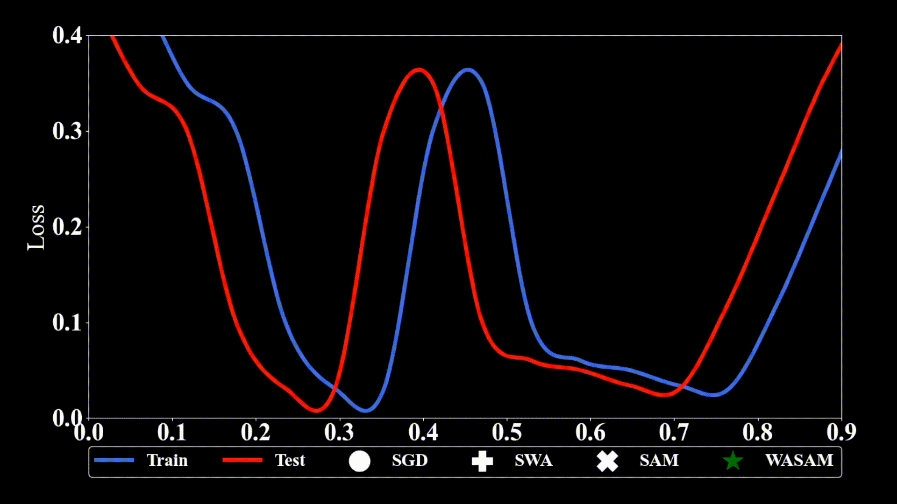

# Weight-Averaged Sharpness-Aware Minimization (WASAM)



A minimum working example for incorporating [WASAM](https://arxiv.org/pdf/2202.00661.pdf) in an image classification pipeline implemented in PyTorch.

# Usage
## Simple option: Single closure-based step function with single set of averaged weights
```python
from wasam import WASAM
...

model = YourModel()
base_optimizer = torch.optim.SGD(lr=0.1, momentum=0.9)  # define an optimizer for the "sharpness-aware" update
optimizer = WASAM(model.parameters(), base_optimizer, rho=0.05, lr=0.1, momentum=0.9)
max_epochs, swa_start_coeff = 200, 0.75
swa_start_epoch = int(max_epochs * swa_start_coeff)
...
for epoch in range(1, max_epochs+1):
    # train one epoch
    for input, output in loader:
      def closure():
        loss = loss_function(output, model(input))
        loss.backward()
        return loss
    
      loss = loss_function(output, model(input))
      loss.backward()
      optimizer.step(closure) # performs model update and zeros gradients internally
    # during end of training, average weights 
    if epoch >= swa_start_epoch:
        optimizer.update_swa()
    # before model evaluation, swap weights with averaged weights
    optimizer.swap_swa_sgd()
    evaluate_model(model)
    # after model evaluation, swap them back (if training continues)
    optimizer.swap_swa_sgd()
...
```

## Advanced option: Two forward and backward passes in training loop and multiple averaged weights
This option is slightly more complicated but enables higher flexibility. 

There are two differences: 
1) We perform both forward and backward passes directly in the training loop
2) We store and update multiple averaged models starting at different times


```python
from wasam import WASAM
from swa_utils import MultipleSWAModels
...
device = torch.device("cuda:0")
model = YourModel()
base_optimizer = torch.optim.SGD(lr=0.1, momentum=0.9)  # define an optimizer for the "sharpness-aware" update
optimizer = WASAM(model.parameters(), base_optimizer, rho=0.05)
max_epochs, swa_start_coeff = 200, 0.75
swa_starts = [0.5, 0.6, 0.75, 0.9]
swa_models = MultipleSWAModels(model, device, max_epochs, swa_starts)
...
for epoch in range(1, max_epochs+1):
    # train one epoch
    for input, output in loader:
        # first forward-backward pass
        loss = loss_function(output, model(input))  # use this loss for any training statistics
        loss.backward()
        optimizer.first_step(zero_grad=True)
        # second forward-backward pass
        loss_function(output, model(input)).backward()  # make sure to do a full forward pass
        optimizer.second_step(zero_grad=True)
    # average weights 
    swa_models.update_parameters(model, epoch) # checks if epoch >= swa_start internally
    # for model evaluation, you can loop over all averaged models
    for model_dict in swa_models.models:
        swa_model, swa_start = model_dict["model"], model_dict["start"]
        if epoch >= swa_start:
            evaluate_model(swa_model)
...
```

## Tips

### BatchNorm Layers
If your model possesses BatchNorm layers, you have to update the activation statistics of the **averaged** model, before you can use it.
Here is a modified version of the simple option example. 
```python
from wasam import WASAM
...

model = YourModel()
base_optimizer = torch.optim.SGD(lr=0.1, momentum=0.9)  # define an optimizer for the "sharpness-aware" update
optimizer = WASAM(model.parameters(), base_optimizer, rho=0.05, lr=0.1, momentum=0.9)
max_epochs, swa_start_coeff = 200, 0.75
swa_start_epoch = int(max_epochs * swa_start_coeff)
...
for epoch in range(1, max_epochs + 1):
    train_model(loader, model, optimizer)
    # during end of training, average weights 
    if epoch >= swa_start_epoch:
        optimizer.update_swa()
    # before model evaluation, swap weights with averaged weights
    optimizer.swap_swa_sgd()
    optimizer.bn_update(loader, model) # <-------------- Update batchnorm statistics
    evaluate_model(model)
    # after model evaluation, swap them back (if training continues)
    optimizer.swap_swa_sgd()
...
```

Similarly, in the advanced option, one can update them as follows:
```python
# for model evaluation, you can loop over all averaged models
for model_dict in swa_models.models:
    swa_model, swa_start = model_dict["model"], model_dict["start"]
    if epoch >= swa_start:
        optimizer.bn_update(loader, swa_model) # <-------------- Update batchnorm statistics
        evaluate_model(swa_model)
```

# Installation

Install packages by 

```pip install -r requirements.txt```

Then, you can run

```
cd example
python main.py
```

## Citation

If you find this repository useful, please consider citing the paper. 

```
@inproceedings{
    kaddour2022when,
    title={When Do Flat Minima Optimizers Work?},
    author={Jean Kaddour and Linqing Liu and Ricardo Silva and Matt Kusner},
    booktitle={Advances in Neural Information Processing Systems},
    editor={Alice H. Oh and Alekh Agarwal and Danielle Belgrave and Kyunghyun Cho},
    year={2022},
    url={https://openreview.net/forum?id=vDeh2yxTvuh}
}
```

## Acknowledgements

This codebase builds on other repositories:

* [(Adaptive) SAM Optimizer (PyTorch)](https://github.com/davda54/sam). 
* [A PyTorch implementation for PyramidNets](https://github.com/dyhan0920/PyramidNet-PyTorch.git)
* [Label Smoothing in PyTorch](https://stackoverflow.com/questions/55681502/label-smoothing-in-pytorch)
* [torch-contrib](https://github.com/pytorch/contrib)

Thanks a lot to the authors of these!
